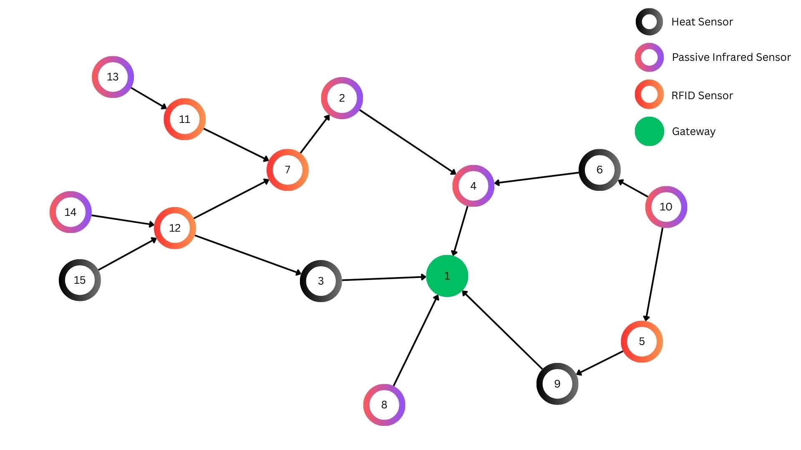

# Surprise-based BA-POMDP: Entropy-Regularized Value Iteration with Adaptive Learning

POMDP-based adaptation for IoT networks: entropy-regularized solvers (ERPerseus, ERPBVI) plus **varSMiLE** (surprise-driven learning of Transition & Observation transition beliefs) and **MIS** (Mutual Information Surprise) for adaptive gamma. Goals: minimize energy (MEC) and packet loss (RPL).

## Contents

- [Navigating the repository](#navigating-the-repository)
- [Prerequisites](#prerequisites)
- [Quick start: run a single experiment](#quick-start-run-a-single-experiment)
- [Creating your own config files](#creating-your-own-config-files)
- [Running with your config](#running-with-your-config)
- [Replicating paper results](#replicating-paper-results)
- [Ablation studies](#ablation-studies)
- [Generating charts](#generating-charts)
- [Configuration (solver.config)](#configuration-srcsolverconfig)
- [Main output files](#main-output-files)
- [Troubleshooting](#troubleshooting)
- [Algorithm and code](#algorithm-and-code-short)
- [References](#references)
- [License](#license)

## Navigating the repository

| Path | Purpose |
|------|---------|
| **`domains/`** | POMDP domain files (e.g. `IoT.POMDP`, `IoT2.POMDP`). |
| **`src/`** | Java source: `main/SolvePOMDP.java` (entry point), `solver/` (ERPerseus, etc.), `iot/DeltaIOTConnector.java` (varSMiLE, surprise), `pomdp/`. |
| **`src/solver.config`** | Main solver configuration (algorithm, lambda, seeds, NFR thresholds, link failure, etc.). Can be overridden with `-DconfigPath=<path>`. |
| **`scripts/`** | Python helpers: **`init_solver_config.py`** (interactive config builder), **`run_ablation.py`** (ablation runner), **`config_utils.py`** (shared config I/O). |
| **`createCharts.py`** | Chart generation (MEC/RPL, surprise, gamma, MIS, mote metrics). Run after a solver run; can target a specific output directory. |
| **`output_dir/`** | Default solver output (created on first run). With custom configs or ablations, output may go to subdirs like `output_dir/results/init_runs/s222/` or `output_dir/results/abl1_lambda/...`. |
| **`output_dir/results/`** | Ablation and init-run results: `configs/`, `abl1_lambda/`, `abl2_pc/`, …, `summary_*.csv`, `figures/`. |
| **`libraries/`** | JARs (solver, DeltaIoT/Simulator, Log4j, etc.). |
| **`docs/`** | Documentation and figures (e.g. DeltaIoT architecture). |

## Prerequisites

- **JDK 8+**
- **Python 3.7+** (for `createCharts.py` and `scripts/`)
- **DeltaIoT / Simulator JARs** in `libraries/` (and any deps, e.g. `json-simple`). Ensure `Simulator.jar` and `deltaiot` JARs are on the classpath.
- **Log4j 2** (optional but recommended): add `log4j-api-2.24.3.jar` to `libraries/`. The root `log4j2.xml` is picked up when the classpath includes `.` (e.g. `.;bin;libraries/*` on Windows).

## Machine setup (development and run environment)

This project was developed and run on the following machine. You can update this section with your own environment for reproducibility.

| Item | Details |
|------|---------|
| **OS** | Windows 10 (build 26100) |
| **CPU** | x64 |
| **RAM** | 16 GB |
| **JDK** | OpenJDK 8+ or Oracle JDK 17 (e.g. `java -version` → 17.x) |
| **Python** | 3.7+ (e.g. 3.10 or 3.11 with venv) |
| **Working directory** | Project root `L4Project` (or workspace root; see Run on a Local Machine) |

- **Notes:** A single full run (500 timesteps, default belief sampling) typically completes in a few minutes.

## Architecture

DeltaIoT is a sensor network of **Heat**, **PIR**, and **RFID** nodes with a **Gateway**. Data flows from sensors toward the gateway; the POMDP plans DTP/ITP actions to tune power and spreading factor.



## Quick start: run a single experiment

### 1. Clone and go to the project

```bash
cd /path/to/workspace/L4Project
```

### 2. Python environment (for charts and scripts)

```bash
python -m venv .venv
# Windows:  .venv\Scripts\activate
# Linux/Mac:  source .venv/bin/activate
pip install -r requirements.txt
```

### 3. Compile and run the solver

- **Algorithm and domain:** Controlled by `src/solver.config` (e.g. `algorithmType=erperseus`, `outputDirectory=output_dir`). Domain: `domains/IoT.POMDP` (or `IoT2.POMDP` as wired in code).

**From Eclipse**

1. Import `L4Project`, add `libraries/*` to the build path.
2. Run **`main.SolvePOMDP`** (Run As → Java Application, working dir = project root).

**From command line**

```bash
cd L4Project

# Compile (adjust to your layout; include all src and libraries)
javac -cp "libraries/*" -d bin -sourcepath src src/main/*.java src/pomdp/*.java src/solver/*.java src/iot/*.java

# Run (Windows use ;  Linux/Mac use :). Quote -cp in Bash: -cp ".;bin;libraries/*"
java -cp ".;bin;libraries/*" main.SolvePOMDP
```

### 4. Output and charts

- **Output directory:** As set in `solver.config` (default `output_dir/`). Main files: `gamma.txt`, `surpriseMIS.txt`, `MISBounds.txt`, `MECSattimestep.txt`, `RPLSattimestep.txt`, `SelectedAction.txt`, `mote_metrics.txt`, etc.
- **Charts:** After a run, the solver invokes `createCharts.py` automatically with the same `outputDirectory`, `mecThreshold`, and `rplThreshold` from the config. To run charts by hand (e.g. for default `output_dir`): `python createCharts.py`. See [Generating charts](#generating-charts) for targeting a specific directory and thresholds.

---

## Creating your own config files

Use **`scripts/init_solver_config.py`** to create or overwrite a `solver.config` interactively or from environment variables. It prompts for algorithm type, lambda, number of runs and seeds, surprise settings, NFR thresholds, and optional link failure; it writes `src/solver.config` and, for multiple runs, per-seed configs under `output_dir/results/configs/`.

**Interactive (recommended when exploring):**

```bash
cd L4Project
python scripts/init_solver_config.py
```

You will be asked for:

- **algorithmType** (erperseus, perseus, erpbvi, faserpbvi)
- **lambda**, **number of runs**, then **seeds** (e.g. for 3 runs: `222, 223, 224`)
- **useSurpriseUpdating**, **surpriseMeasureForGamma** (CC, BF, MIS), **p_c**, **lookback**
- **mecThreshold**, **rplThreshold**
- **linkFailureTimestep** / **linkFailureLinks** / **linkRecoveryTimestep** (optional; leave empty to disable)

The script writes:

- **`src/solver.config`** (or `--output <path>`) with the first seed and your chosen parameters.
- If number of runs > 1: one config per seed in `output_dir/results/configs/` (e.g. `run_s222.config`, `run_s223.config`), each with its own `outputDirectory` (e.g. `output_dir/results/init_runs/s222`).

**Non-interactive (e.g. from CI or scripts):**

Set environment variables and run with `--non-interactive`. Env names are `SOLVER_` + UPPERCASE key, e.g. `SOLVER_ALGORITHMTYPE`, `SOLVER_LAMBDA`, `SOLVER_NUMRUNS`, `SOLVER_RUNSEEDS` (comma-separated seeds):

```bash
export SOLVER_NUMRUNS=3
export SOLVER_RUNSEEDS=222,223,224
python scripts/init_solver_config.py --non-interactive
```

**Manual editing:** You can also edit `src/solver.config` directly; see [Configuration (solver.config)](#configuration-srcsolverconfig).

---

## Running with your config

- **Single run (default config):** After writing `src/solver.config` (e.g. with `init_solver_config.py`), run the solver as in [Quick start](#quick-start-run-a-single-experiment). Output goes to `outputDirectory` in that config; charts are launched automatically with the same directory and `mecThreshold`/`rplThreshold`.

- **Run with a specific config file:** Use `-DconfigPath=` to point to any `.config` file (e.g. a per-seed config):

  ```bash
  java -DconfigPath=output_dir/results/configs/run_s222.config -cp ".;bin;libraries/*" main.SolvePOMDP
  ```

  (On Bash, quote the classpath: `-cp ".;bin;libraries/*"`.)

- **Multiple seeds (e.g. from init_solver_config):** If you generated several configs (e.g. `run_s222.config`, `run_s223.config`, `run_s224.config`), run the solver once per config. Each config has its own `outputDirectory` (e.g. `output_dir/results/init_runs/s222`). Example loop (Bash):

  ```bash
  for s in 222 223 224; do
    java -DconfigPath="output_dir/results/configs/run_s${s}.config" -cp ".;bin;libraries/*" main.SolvePOMDP
  done
  ```

  After each run, charts are generated automatically for that run’s output directory. You can also generate charts later for a specific directory; see [Generating charts](#generating-charts).

- **Skip chart generation from Java:** Set `-DnoPlots=true` when running `SolvePOMDP` if you only want to produce data and run `createCharts.py` yourself later.

---

## Replicating paper results

The main results in the paper are produced by three repeated runs with seeds 222, 223, and 224, using the following fixed configuration. Pre-generated config files are provided at `output_dir/results/configs/run_s222.config`, `run_s223.config`, and `run_s224.config`.

### Exact configuration used

| Parameter | Value |
|-----------|-------|
| `algorithmType` | `erperseus` |
| `lambda` | `2.0` |
| `surpriseMeasureForGamma` | `MIS` |
| `p_c` | `0.25` |
| `useSurpriseUpdating` | `true` |
| `lookback` | `5` |
| `mecThreshold` | `17.0` |
| `rplThreshold` | `0.17` |
| `runSeed` | `222`, `223`, `224` (one per run) |

Output for each seed is written to `output_dir/results/init_runs/s222`, `s223`, and `s224` respectively.

### Running the three seeds

**Option A — interactive config builder (recommended):**

```bash
cd L4Project
python scripts/init_solver_config.py
# When prompted: algorithmType=erperseus, lambda=2.0, numRuns=3, seeds=222,223,224
# surpriseMeasureForGamma=MIS, p_c=0.25, useSurpriseUpdating=true, lookback=5
# mecThreshold=17.0, rplThreshold=0.17, no link failure
```

**Option B — run directly from pre-generated configs:**

Run each seed sequentially (Bash):

```bash
cd L4Project
for s in 222 223 224; do
  java -DconfigPath="output_dir/results/configs/run_s${s}.config" \
       -cp ".;bin;libraries/*" main.SolvePOMDP
done
```

On Windows Git Bash, quote the classpath to prevent `;` being treated as a command separator. If the wildcard `libraries/*` does not expand correctly, list jars explicitly:

```bash
CP="bin;libraries/Simulator.jar;libraries/antlr-runtime-3.5.2.jar;libraries/commons-math3-3.6.1.jar;libraries/gurobi-10.0.3.jar;libraries/jfreechart-1.5.3.jar;libraries/joptimizer-4.0.0.jar;libraries/json-simple-4.0.1.jar;libraries/jython-standalone-2.7.4.jar;libraries/libpomdp-parser-1.0.0.jar;libraries/log4j-api-2.24.3.jar;libraries/lpsolve-5.5.2.0.jar;libraries/mtj-1.0.4.jar"
for s in 222 223 224; do
  java -DconfigPath="output_dir/results/configs/run_s${s}.config" -cp "$CP" main.SolvePOMDP
done
```

### Generating charts for replication runs

After all three seeds have completed, generate charts for each run with the thresholds that match the config:

```bash
for s in 222 223 224; do
  python createCharts.py \
    --output-dir output_dir/results/init_runs/s${s} \
    --mec-threshold 17 \
    --rpl-threshold 0.17
done
```

---

## Ablation studies

**`scripts/run_ablation.py`** runs predefined ablations (lambda, p_c, lookback, NFR thresholds, disaster/link-failure scenarios) over multiple seeds and surprise measures (MIS, CC, no_surprise), then writes summary CSVs and optional figures. All runs use configs generated from `src/solver.config`; output goes under `output_dir/results/<abl_id>/<surprise>/<run_id>/`.

**Commands (from project root `L4Project`):**

```bash
# Run all ablations (skips already-complete runs unless --overwrite)
python scripts/run_ablation.py run

# Optional: limit ablations, quick mode (1 seed, 2 levels), no figures, overwrite
python scripts/run_ablation.py run --ablations abl1_lambda abl2_pc --quick --no-plots --overwrite

# Only rebuild summary CSVs from existing run directories (no Java runs)
python scripts/run_ablation.py summary

# Only regenerate figures from summary_*_avg.csv files
python scripts/run_ablation.py plots

# Regenerate output_dir/results/README.md
python scripts/run_ablation.py readme
```

**Ablation IDs:** `abl1_lambda`, `abl2_pc`, `abl3_lookback`, `abl4_nfr`, `abl5_disaster`. Each ablation varies one factor (e.g. lambda levels) while keeping others fixed; each configuration is run under three surprise settings (MIS, CC, no_surprise) and three seeds (222, 223, 224) by default.

**Output layout:**

- **`output_dir/results/abl1_lambda/`**, **`abl2_pc/`**, …: one folder per ablation, then subfolders per surprise (e.g. `MIS/`, `CC/`, `no_surprise/`) and per run (e.g. `lam1.0_seed222/`).
- **`output_dir/results/configs/`**: generated per-run config files.
- **`output_dir/results/summary_abl1_lambda.csv`**, **`summary_abl1_lambda_avg.csv`**, etc.: per-run and averaged statistics.
- **`output_dir/results/figures/`**: plots (e.g. `abl1_lambda_metrics.png`).

Details and reproducibility notes are in **`output_dir/results/README.md`** (created by `run_ablation.py readme`).

---

## Generating charts

**`createCharts.py`** builds MEC/RPL satisfaction plots (with configurable threshold lines), surprise and gamma time series, MIS chart, and an interactive Dash app for mote metrics. It can use the default output directory or a directory you specify (e.g. a single ablation or init run).

**When the solver runs:** If chart generation is not disabled (`-DnoPlots=true`), the solver calls `createCharts.py` with:

- `--output-dir` = config’s `outputDirectory` (resolved to absolute path)
- `--mec-threshold` and `--rpl-threshold` = config’s `mecThreshold` and `rplThreshold`

So the red horizontal lines and axis scaling on MEC/RPL plots match the config used for that run.

**Running charts by hand:**

```bash
cd L4Project
# Use default output_dir (and default thresholds 20, 0.2)
python createCharts.py

# Use a specific run directory (e.g. one init run or one ablation run)
python createCharts.py --output-dir output_dir/results/init_runs/s222

# Same, but set thresholds to match the config used for that run
python createCharts.py --output-dir output_dir/results/init_runs/s222 --mec-threshold 17 --rpl-threshold 0.17
```

- **`--output-dir`** must point to a directory that **directly** contains the solver output files (e.g. `MECSattimestep.txt`, `RPLSattimestep.txt`, `gamma.txt`, `mote_metrics.txt`). For example use `output_dir/results/init_runs/s222`, not `output_dir/results/init_runs`.
- **`--mec-threshold`** and **`--rpl-threshold`** set the red horizontal lines and y-axis padding on the MEC and RPL satisfaction plots (defaults 20 and 0.2). Use the same values as in the `solver.config` that produced that run for consistent interpretation.

---

## Configuration (`src/solver.config`)

All hyperparameters are configured in `src/solver.config` (or in a config file passed via `-DconfigPath=`). The following parameters are available:

### General Settings

| Setting | Role | Default |
|--------|------|---------|
| `algorithmType` | Solver algorithm: `erperseus`, `perseus`, `erpbvi`, `faserpbvi` | `erperseus` |
| `lambda` | Entropy regularization temperature (e.g. 0.5–1.0 for ERPerseus); only used by ER solvers | `1.0` |
| `outputDirectory` | Directory for output files | `output_dir` |
| `domainDirectory` | Directory containing `.POMDP` files | `domains` |
| `valueFunctionTolerance` | Convergence threshold (algorithm stops when value difference < tolerance) | `0.000001` |
| `timeLimit` | Maximum runtime in seconds | `1000` |

### Approximate Algorithm Settings

| Setting | Role | Default |
|--------|------|---------|
| `beliefSamplingRuns` | Number of belief sampling runs for approximate solvers | `10` |
| `beliefSamplingSteps` | Steps per belief sampling run | `200` |

### Experiment Parameters (Optional)

These control learning and adaptation and the thresholds used in charts:

| Setting | Role | Default |
|--------|------|---------|
| `runSeed` | Random seed for solver, mote order, policy (vary for repeated runs, e.g. 222, 223, …) | `222` |
| `surpriseMeasureForGamma` | Surprise measure for varSMiLE: `CC`, `BF`, or `MIS` | `MIS` |
| `p_c` | Probability of change in (0,1) for SMiLE gamma; `m = p_c/(1-p_c)` | `0.5` |
| `useSurpriseUpdating` | `true` = varSMiLE (surprise-weighted) updates; `false` = classic Bayesian | `true` |
| `lookback` | Lookback period (m) for MIS calculation | `4` |
| `mecThreshold` | MEC satisfaction threshold (energy); used in solver and in createCharts MEC plot | `20` |
| `rplThreshold` | RPL satisfaction threshold (packet loss ratio); used in solver and in createCharts RPL plot | `0.2` |

### Link Failure Injection (Optional)

| Setting | Role | Default |
|--------|------|---------|
| `linkFailureTimestep` | Timestep at which to turn off listed links (omit or leave empty to disable) | - |
| `linkFailureLinks` | Comma-separated source-dest link IDs, e.g. `12-7, 12-3` | - |
| `linkRecoveryTimestep` | Timestep at which to turn the same links back on (omit for no recovery) | - |

### Output Files

| Setting | Role | Default |
|--------|------|---------|
| `dumpActionLabels` | Use action labels instead of numbers in output files | `true` |

**Note:** Modify `solver.config` (or use `init_solver_config.py`) before running to change any of these parameters. When using `-DconfigPath=`, the specified file defines `outputDirectory`, `mecThreshold`, and `rplThreshold` for that run and for the subsequent chart generation.

## Main Output Files

| File | Content |
|------|---------|
| `gamma.txt` | varSMiLE mixing factor per mote/timestep |
| `surpriseCC.txt`, `surpriseBF.txt`, `surpriseMIS.txt` | Surprise measures per mote |
| `MISBounds.txt` | MIS 95% bounds |
| `MECSattimestep.txt`, `RPLSattimestep.txt` | Gateway QoS (energy, packet loss) per timestep |
| `SelectedAction.txt` | DTP/ITP action per timestep |
| `mote_metrics.txt` | Per-mote/per-link SNR, power, distribution, SF |
| `IoT.alpha` | Alpha vectors of the solved value function |

## Troubleshooting

- **`solver.config` or `domains/IoT.POMDP` not found**  
  Run from `L4Project` (project root).

- **ClassNotFoundException / missing Simulator or deltaiot**  
  Add `Simulator.jar`, `deltaiot` JARs (and deps) to the classpath, e.g. in `libraries/`.

- **Charts not opening**  
  Activate the venv, `pip install -r requirements.txt`, and run `python createCharts.py` (or with `--output-dir` and optional thresholds) after a full run so the chosen output directory is populated.

- **createCharts.py KeyError: 'timestep' or no data**  
  Ensure `--output-dir` points to a directory that **directly** contains the solver output files (e.g. `output_dir/results/init_runs/s222`), not a parent folder that only contains subdirectories.

- **Bash: classpath with semicolons**  
  On Git Bash or other Unix shells, quote the classpath so `;` is not interpreted as a command separator: `-cp ".;bin;libraries/*"`.

## Algorithm and Code (short)

- **ERPerseus:** `src/solver/ERPerseus.java` — Perseus with softmax over actions and value vectors (λ).
- **varSMiLE:** `DeltaIOTConnector.updateTransitionBelief` — gamma from surprise (CC, BF, or MIS); `transitionBeliefCurr` and `observationBelief` drive `getTransitionProbability` / `getObservationProbability`.
- **Surprise / MIS:** `DeltaIOTConnector` (e.g. `confidenceCorrectedSurprise`, `bayesFactorSurprise`, `calculateAndStoreMIS`); MIS bounds follow the 95% interval in the MIS surprise paper.

## References

- *Mutual Information Surprise* — [arXiv:2508.17403](https://www.arxiv.org/pdf/2508.17403)
- *Perseus* — Spaan & Vlassis, JAIR 2005
- *Entropy-regularized PBVI* — Delecki et al., arXiv:2402.09388
- *varSMiLE* — Liakoni et al., Neural Computation 2021

## License

GPL-3.0. Based on SolvePOMDP by Erwin Walraven (TU Delft); extended for IoT and varSMiLE/ER.
